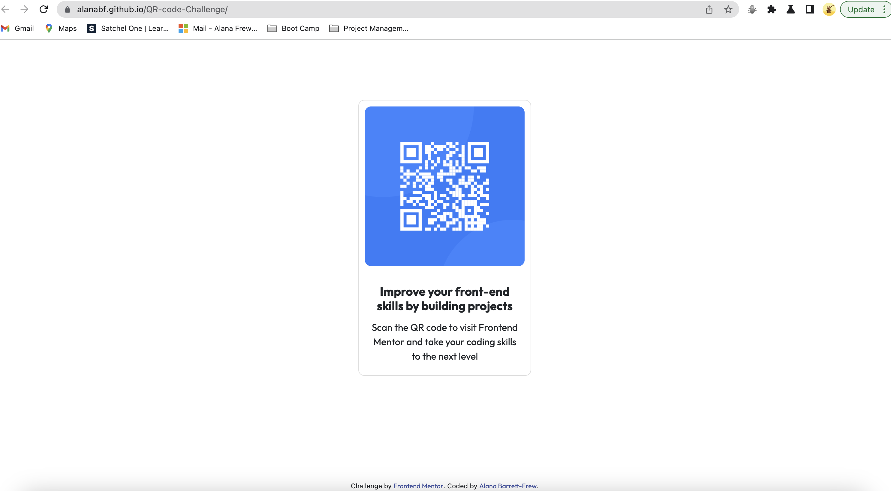

# Frontend Mentor - QR code component - My Solution

This is a solution to the [QR code component challenge on Frontend Mentor](https://www.frontendmentor.io/challenges/qr-code-component-iux_sIO_H). Frontend Mentor challenges help you improve your coding skills by building realistic projects.

## Overview

### Screenshot

### Links

- Deployed Site URL: [Solution](https://alanabf.github.io/QR-code-Challenge/)

### Built with

- Semantic HTML5 markup
- CSS custom properties
- Bootstrap

## Author

- Website - [Alana Barrett-Frew](https://alanabarrettfrew.com)
- Frontend Mentor - [@AlanaBF](https://www.frontendmentor.io/profile/AlanaBF)
- Twitter - [@AlanaBF81](https://twitter.com/AlanaBF81)